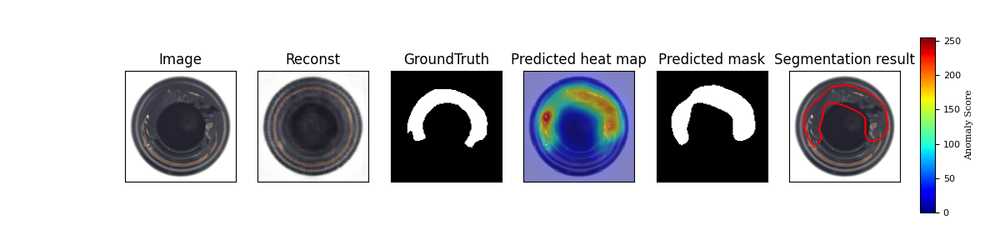
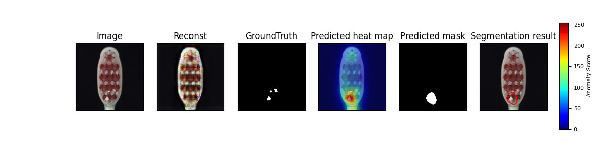

# Feature-Augmented VAE for Anomaly Detection and Localization

This project implements a **Feature-Augmented Variational Autoencoder (VAE)** for anomaly detection and localization. It is designed for applications where detecting and highlighting anomalous regions is essential, such as quality control in manufacturing or medical imaging.

## Table of Contents
- [About](#about)
- [Features](#features)
- [Installation](#installation)
- [Usage](#usage)
- [Project Structure](#project-structure)
- [Results](#results)
- [Contributing](#contributing)


## About
This repository contains code for training and evaluating a feature-augmented VAE model designed to:
- Detect anomalies in datasets.
- Localize the specific regions of interest where anomalies are found.
- Use data preprocessing, feature augmentation, and visualization techniques to improve anomaly detection performance.

The VAE model is enhanced with additional feature layers to capture nuanced patterns within data, making it well-suited for applications in automated defect detection and other anomaly-sensitive domains.

## Features
- **VAE Model** with customized augmentation layers for enhanced feature extraction.
- **Preprocessing Pipeline** to prepare datasets for training and testing.
- **Anomaly Detection and Localization** using learned representations.
- **Visualization Tools** to display detected anomalies and localized regions.
- **Customizable Dataset** module for integrating different types of datasets.

## Installation

Clone this repository and install the required dependencies.

```bash
git clone https://github.com/AbelAbeb/Feature_Augmented_VAE_Anomaly_detection_and_localization.git
cd Feature_Augmented_VAE_Anomaly_detection_and_localization
pip install -r requirements.txt
```

## Usage

1. **Prepare the Dataset**:
   Place your dataset images in the designated `datasets` directory, or modify `datasets/mvtec.py` to load custom datasets.

2. **Train the Model**:
   To train the model, run:
   ```bash
   python train.py
   ```
   Customize training parameters in the `train.py` script as needed.

3. **Test the Model**:
   To evaluate the model and visualize results, use:
   ```bash
   python test.py
   ```

## Project Structure

```
Feature_Augmented_VAE_Anomaly_detection_and_localization/
├── datasets/               # Data loading and preprocessing scripts
│   ├── mvtec.py
│   └── preprocessing.py
├── imgs/                   # Example images and visualization outputs
├── models/                 # Model architecture and initialization files
│   ├── VAE.py
│   └── __init__.py
├── utils.py                # Utility functions for training, evaluation, etc.
├── func.py                 # Core functions and helper methods
├── train.py                # Training script
├── test.py                 # Testing and evaluation script
└── requirements.txt        # Python dependencies
```

## Results

### Sample Outputs
Here are some examples of the outputs produced by the model:


*Example of an anomaly detected in an image.*


*Another example of a localized anomaly.*

### Model Architecture
The architecture of the feature-augmented VAE is as follows:


*Visualization of the VAE model architecture.*

## Contributing
Contributions are welcome! Please fork the repository, create a new branch, and submit a pull request with your changes.

